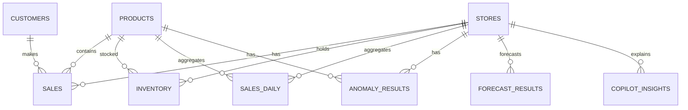
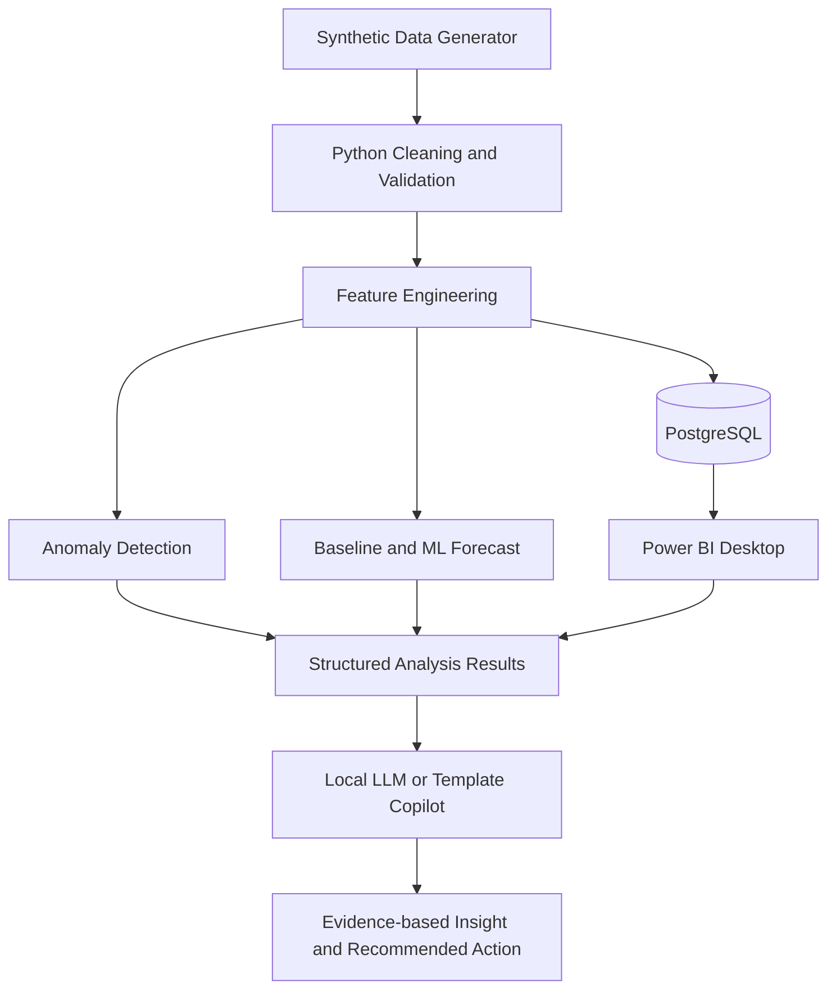

# AI Operations Copilot - MVP Project Design

本書は、AI Operations Copilot の実装前に合意するための設計書です。MVPでは、実在企業のデータや機密情報を使用せず、再現可能なSynthetic Dataだけを使用します。Azureの有料サービスや有料APIは必須にしません。

## 1. Business Problem

企業の売上、在庫、顧客、店舗データは複数の業務システムやExcelに分散し、担当者が手作業で確認・統合することがあります。その結果、次の問題が発生します。

- 店舗別の売上低下や急増を早期に発見しにくい
- 売上変化、顧客数、在庫状況を同じ視点で比較しにくい
- 欠品リスクや異常値の確認に時間がかかる
- Power BIの可視化が現状把握で止まり、次に何を確認するかが明確でない
- 分析結果の根拠と推測が混在し、意思決定者が信頼性を判断しにくい

AI Operations Copilotは、Synthetic Business DataをPythonで整形・分析し、PostgreSQLとPower BIに連携します。Pythonの分析結果を構造化してAIに渡し、事実、可能性、リスク、推奨アクションを分離した意思決定支援を行います。

## 2. Target Users

| ユーザー | 主な目的 | 必要な情報 |
| --- | --- | --- |
| 経営・事業責任者 | 事業全体の状況と優先課題を把握する | 売上、利益、成長率、重大アラート、リスク |
| 店舗責任者 | 担当店舗の異常と対応事項を確認する | 店舗トレンド、顧客数、在庫、異常、推奨確認事項 |
| 商品・在庫担当者 | 欠品リスクと商品別の問題を把握する | 商品売上、粗利、在庫、在庫回転、欠品リスク |
| Data/AI Engineer | データパイプラインとモデルの品質を検証する | データ品質、特徴量、評価指標、再現手順、分析ログ |
| 採用担当者・技術レビュアー | 実務を想定した技術力を短時間で評価する | 目的、設計、データフロー、評価結果、制約、課題 |

MVPの主要ユーザーは「経営・事業責任者」と「店舗・在庫担当者」です。Data/AI Engineer向けの技術情報は、運用画面ではなくドキュメントと分析成果物で提供します。

## 3. Business Requirements

| ID | 要件 | 成功条件 |
| --- | --- | --- |
| BR-01 | 売上、顧客、在庫を統合して確認できること | 店舗・商品・日付で同じ指標を比較できる |
| BR-02 | 問題の発生箇所を特定できること | 店舗・商品単位で異常とリスクを絞り込める |
| BR-03 | 過去の状況だけでなく近い将来のリスクを確認できること | ベースラインとML予測を比較できる |
| BR-04 | AIの説明がデータに基づくこと | EvidenceとPossible Factorsを分離して表示する |
| BR-05 | 優先して確認すべき事項が分かること | リスクレベル、根拠、推奨アクションを提示する |
| BR-06 | 再現可能なポートフォリオであること | Synthetic Data生成から分析までをローカルで再実行できる |
| BR-07 | 有料クラウドに依存しないこと | Docker ComposeとローカルツールでMVPを動かせる |

## 4. Functional Requirements

### 4.1 Data and ETL

- `stores`、`products`、`sales`、`inventory`、`customers` のSynthetic Dataを生成できる
- 生成データに季節性、店舗差、商品カテゴリ差、キャンペーン影響、在庫変動を設定できる
- 欠損、重複、異常値、参照整合性を検出・記録できる
- 日付、店舗、商品、顧客に関する分析用の特徴量を作成できる
- Cleaned Dataと分析結果をPostgreSQLへロードできる
- 同じseedを指定した場合に同じデータを再生成できる

### 4.2 Analytics and Machine Learning

- Total Sales、Sales Growth、Gross Profit、Customers、Inventoryを算出できる
- 店舗別、商品別、日別に売上・顧客・利益を集計できる
- 売上急減、売上急増、在庫異常、欠品リスクを検出できる
- 異常検知モデルとルールベースの判定結果を区別して保存できる
- Sales ForecastについてBaselineとML Modelを比較できる
- MAE、RMSEなどの実測評価値を計算し、評価データ期間とともに保存できる
- 評価を実行していない場合、READMEや画面に精度値を表示しない

### 4.3 AI Operations Copilot

- Python分析結果を、店舗・商品・期間・指標・リスクを含む構造化データに変換できる
- AIへ生のデータベース全体を渡さず、分析済みの事実と根拠だけを渡せる
- 出力を次の固定セクションで生成できる
  - Current Situation
  - Evidence
  - Possible Factors
  - Risk
  - Recommended Action
- 観測事実と推測を明示的に区別できる
- 根拠が不足している場合、「確認できない」と表現できる
- 初期実装ではローカルLLMまたはテンプレート生成を利用し、有料APIを必須にしない

### 4.4 Power BI

- PostgreSQLまたは分析出力をPower BI Desktopから読み込める
- Power Queryでデータ型、日付、リレーションに必要な整形を行える
- DAX Measuresで主要KPIと成長率を計算できる
- 5ページのダッシュボードで、経営、店舗、商品、予測、AI Insightを確認できる
- アラートから店舗・商品・根拠データへドリルダウンできる

### 4.5 Documentation and Operations

- Docker ComposeでPostgreSQLを起動できる
- データ生成、ETL、分析、評価の実行手順を再現できる
- 失敗したデータ検証やモデル評価をログで確認できる
- Power BIの接続方法、更新方法、スクリーンショット配置場所をREADMEで説明できる

## 5. Non-functional Requirements

| 分類 | 要件 | MVPの確認方法 |
| --- | --- | --- |
| 再現性 | Synthetic Dataはseedと生成条件を記録する | 同じseedで同じレコード特性を確認 |
| データ安全性 | 実在企業・個人の機密データを使用しない | データ生成元とREADMEをレビュー |
| 説明可能性 | AIの事実、根拠、推測、推奨を分離する | 固定出力形式のテスト |
| 正確性 | 未測定の精度・性能値を公開しない | 評価ファイルとREADMEを照合 |
| 保守性 | ETL、ML、AI、BI用の成果物を分離する | ディレクトリと責務をレビュー |
| 可搬性 | ローカルDocker環境で動かせる | 新しい環境でセットアップ手順を実行 |
| 可観測性 | データ件数、欠損、異常、評価指標を記録する | 実行ログとレポートを確認 |
| 性能 | MVPでは大量データ処理を目標にしない | 小規模Synthetic Dataの完了を基準にする |
| セキュリティ | 秘密情報をリポジトリへ保存しない | `.env`をGit管理対象外にする |
| アクセシビリティ | Power BIで色だけに依存せず、ラベルと表を併用する | 各ページを目視レビュー |

## 6. MVP Scope

### In Scope

- 対象データ: `stores`、`products`、`sales`、`inventory`、`customers`
- PythonによるSynthetic Data生成、データ品質チェック、ETL
- PostgreSQLへの格納と分析用ビューまたはテーブル
- 売上KPI、店舗分析、商品分析、在庫分析
- ルールベースのアラートとIsolation Forestなどを用いた異常検知の検証
- BaselineとML Modelによる売上予測比較
- MAE/RMSEによる実測評価
- Power BI Desktopの5ページ設計
- 構造化分析結果を入力とするローカルAIまたはテンプレート型Copilot
- Docker Compose、テスト、README、アーキテクチャ説明

### Out of Scope

- 実在企業データ、個人情報、機密情報の利用
- Azureへの有料デプロイ、常時稼働のAPI、認証・権限管理
- リアルタイムストリーミング、モバイルアプリ、複数テナント
- 自動発注や自動意思決定など、担当者の承認を伴わない業務実行
- 因果推論を行わずに原因を断定する機能
- 精度や処理性能の実測前の数値目標の公表

### MVP完了条件

1. Synthetic Dataをseed付きで再生成できる。
2. データ品質チェックを通過したデータをPostgreSQLへロードできる。
3. KPI、異常、予測、評価指標を再実行できる。
4. Power BIの5ページで同じ分析結果を確認できる。
5. AI出力が事実と推測を分け、根拠を参照できる。
6. Docker、テスト、READMEの手順を第三者が追跡できる。

## 7. Data Model

### 7.1 Logical Entities

| Entity | 主な属性 | 役割 |
| --- | --- | --- |
| stores | `store_id`, `store_name`, `region`, `store_type`, `opened_date` | 店舗のマスタ |
| products | `product_id`, `product_name`, `category`, `unit_cost`, `unit_price` | 商品のマスタ |
| customers | `customer_id`, `segment`, `region`, `signup_date` | 顧客の分析用属性 |
| sales | `sale_id`, `sale_date`, `store_id`, `product_id`, `customer_id`, `quantity`, `unit_price`, `discount` | 売上明細 |
| inventory | `inventory_date`, `store_id`, `product_id`, `stock_on_hand`, `reorder_point`, `stock_in`, `stock_out` | 日次在庫スナップショット |
| sales_daily | `date`, `store_id`, `product_id`, `sales_amount`, `gross_profit`, `customer_count` | 分析用集計 |
| anomaly_results | `detected_at`, `entity_type`, `entity_id`, `anomaly_type`, `score`, `evidence` | 異常検知結果 |
| forecast_results | `forecast_date`, `store_id`, `model_name`, `predicted_sales`, `actual_sales`, `mae`, `rmse` | 予測と評価結果 |
| copilot_insights | `insight_id`, `created_at`, `scope`, `facts`, `evidence`, `possible_factors`, `risk`, `recommended_action` | AI入力・出力の監査可能な構造化結果 |

### 7.2 Relationships

分析結果テーブルには、元データの期間、対象ID、使用したモデルまたはルール、生成日時を保持します。これにより、AIの説明がどの分析結果に基づくかを追跡できます。

## 8. Architecture

### Component Responsibilities

- **Synthetic Data Generator**: 現実的な店舗差、季節性、キャンペーン、在庫変動を持つデータを生成する。
- **Python Cleaning and Validation**: 型、欠損、重複、参照整合性、範囲を検証する。
- **Feature Engineering**: 前日比、移動平均、顧客数変化、在庫日数、欠品リスクなどを作成する。
- **PostgreSQL**: cleaned data、分析用データ、モデル結果の共通データ基盤にする。
- **Power BI Desktop**: KPIとドリルダウンを提供する。Power BIは意思決定画面であり、モデル計算の唯一の場所にはしない。
- **ML**: 異常検知と予測を実行し、モデル名、期間、特徴量、評価結果を保存する。
- **Copilot**: 構造化された分析結果だけを受け取り、事実と推測を分けて説明する。

データフローは `Synthetic Raw Data -> Python ETL -> PostgreSQL -> Power BI / Python ML -> Structured Results -> AI Operations Copilot` とします。

## 9. Development Roadmap

| Phase | 目的 | 成果物 | 使用技術 | 完了条件 | 次への依存関係 |
| --- | --- | --- | --- | --- | --- |
| 1. Business Problem | 問題と価値を定義する | Problem Statement、対象ユーザー | Markdown | 業務課題と対象者が合意される | Phase 2 |
| 2. Requirements Definition | MVP境界と要件を確定する | 本設計書、受入条件 | Markdown | In/Out Scopeと要件が確定する | Phase 3 |
| 3. Data Design | エンティティと指標を設計する | ER図、データ辞書、KPI定義 | PostgreSQL設計、Mermaid | 粒度、キー、リレーションが確定する | Phase 4 |
| 4. Synthetic Data Generation | 再現可能な業務データを作る | Generator、生成条件、サンプル | Python、pandas、NumPy | seed付き生成と品質条件が確認される | Phase 5 |
| 5. PostgreSQL | 共通データ基盤を作る | Schema、migration、load手順 | PostgreSQL、Docker | データをロード・参照できる | Phase 6 |
| 6. Python ETL | cleaned dataと特徴量を作る | ETL pipeline、quality report | Python、pandas | ETLを再実行でき、検証結果が残る | Phase 7/8 |
| 7. Machine Learning | 異常・予測を評価する | anomaly/forecast results、評価レポート | scikit-learn | BaselineとMLを同じ評価期間で比較できる | Phase 8/9 |
| 8. Power BI | 分析を業務画面にする | PBIX、DAX、Power Query設計 | Power BI Desktop | 5ページでKPIとリスクを確認できる | Phase 9 |
| 9. AI Operations Copilot | 説明と行動提案を作る | structured result、prompt/output、guardrail | Python、Ollamaまたはテンプレート | Evidenceと推測が分離される | Phase 10 |
| 10. Docker | ローカル再現環境を整える | Dockerfile、Compose、env example | Docker、Docker Compose | 初期化から分析まで手順化される | Phase 11 |
| 11. Testing | 品質と回帰を確認する | unit、data quality、integration tests | pytest | 主要受入条件が自動確認される | Phase 12 |
| 12. Documentation | 第三者が理解・再実行できるようにする | README、architecture、screenshots | Markdown、Mermaid | READMEだけで目的と起動方法が分かる | Phase 13 |
| 13. GitHub Portfolio Optimization | 採用担当者向けに整理する | README改善、demo、limitations | Git、GitHub | 実測結果と未実装範囲が明記される | 完了 |

Phase 2とPhase 3の確認が完了するまで、実装コードは開始しません。Phase 7とPhase 8はPhase 6の分析用データ設計に依存し、Phase 9は構造化された分析結果に依存します。

## 10. Power BI Dashboard Design

### 共通設計

- 共通のDate、Store、Productディメンションでページ間のフィルターを統一する
- KPIカードには値だけでなく対象期間と比較期間を表示する
- 異常とリスクは色だけに頼らず、ラベル、アイコン、表形式を併用する
- 各アラートには対象ID、検知日、ルールまたはモデル、根拠指標を表示する
- DAX Measuresは売上、成長率、粗利、顧客数、在庫、アラート数を定義し、計算ロジックを文書化する

### Page 1 - Executive Overview

**目的**: 経営・事業責任者が最初に全体状況と優先課題を確認する。

- KPI: Total Sales、Sales Growth、Gross Profit、Customers、Inventory、Alerts
- 日次または週次の売上トレンド
- 店舗別の売上・成長率ランキング
- High Risk店舗・商品一覧
- KPIからStore Analysis、Product Analysis、Forecast & Riskへのドリルスルー

### Page 2 - Store Analysis

**目的**: 店舗ごとの差と異常の背景を比較する。

- 店舗比較: 売上、成長率、粗利、顧客数
- 店舗選択時の日次・週次売上トレンド
- 顧客数トレンドと売上の比較
- 店舗別利益と利益率
- 異常一覧: 種類、スコア、検知日、Evidence

### Page 3 - Product Analysis

**目的**: 商品の売上・利益・在庫の優先課題を特定する。

- 商品別売上、数量、粗利、利益率
- カテゴリ別比較
- 在庫残数、在庫日数、入出庫
- Stockout RiskとReorder Pointの比較
- 売上は高いが在庫リスクも高い商品を確認する表

### Page 4 - Forecast & Risk

**目的**: 近い将来の売上とリスクを確認する。

- 実績、Baseline予測、ML予測の時系列比較
- 予測期間と評価期間を明示
- MAE、RMSE、モデル名、評価対象期間
- 店舗別の予測リスクランキング
- 異常検知結果と欠品リスクの組み合わせ

### Page 5 - AI Insights

**目的**: 分析結果を確認し、担当者が次に確認すべき行動を把握する。

- Detected Problems
- Data Evidence: 指標、期間、対象、値、比較値
- AI Summary
- Possible Factors: データから確認できない場合は推測として表示
- Risk: Low、Medium、Highと判定根拠
- Recommended Actions: 自動実行ではなく、担当者が確認・判断するアクション
- 元の店舗、商品、異常、予測結果へのドリルスルー

Power BIはAIの文章を事実の代替にしません。AI Insightsページでは、文章の横にEvidenceと元データへの導線を置き、担当者が結論を検証できるようにします。