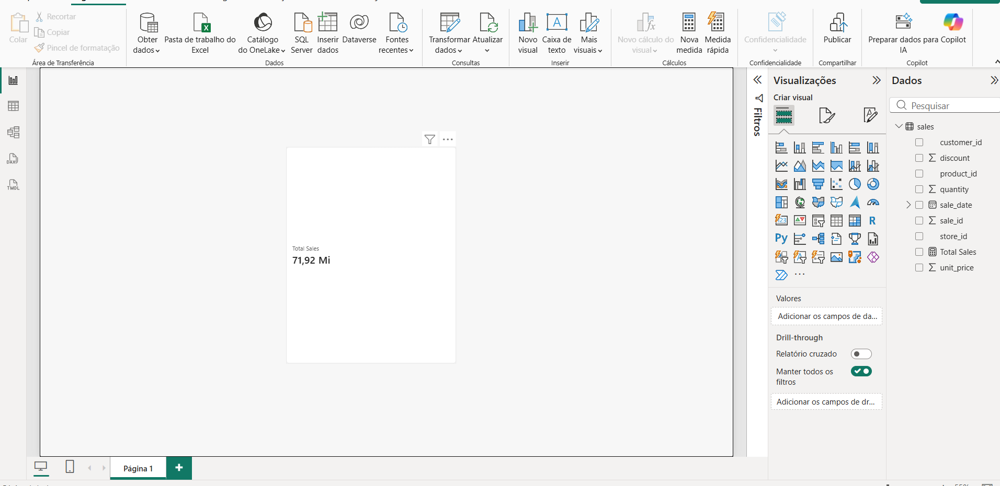

# AI Operations Copilot

> **Status: In development / MVP prototype**

AI x Data Engineering x DX x Power BI x Machine Learning を組み合わせた、業務データに基づく意思決定支援プロジェクトです。

これは完成済みのWebサイトではありません。現在は、Synthetic Dataを作り、Power BIで最初のKPIを表示する段階です。今後、PostgreSQL、異常検知、売上予測、Evidence-first AI Insightを段階的に接続します。

## What Is This?

企業の店舗・商品・顧客・売上・在庫データを統合し、次の質問に答えることを目指します。

- どの店舗の売上が高い、または低下しているか
- どの商品に在庫不足のリスクがあるか
- 売上の異常や将来のリスクはどこにあるか
- 担当者が最初に確認すべき問題は何か

最終的には、Pythonで分析した根拠をPower BIとAI Operations Copilotへ渡します。AIは確認できた事実と推測を分け、原因を根拠なしに断定しません。

## Current Development Stage

現在は **Phase 4〜8の初期部分**です。

- Synthetic Dataを生成済み
- Power BI用CSVを作成済み
- Power BIで `sales.csv` を読み込み、`Total Sales` の最初のカードを作成済み
- DAX、データ辞書、カレンダーテーブルの設計を文書化済み
- Python側にETL、品質検証、異常検知、予測、Insight生成のMVPコードを実装済み
- PostgreSQLのDDLとDocker Composeを準備済み

まだ未完成の部分:

- Power BIの5ページ全体
- Power BIとPostgreSQLの接続
- AI画面とローカルLLMの接続
- 追加ページのスクリーンショットと実測評価レポート
- 本番運用、認証、Azureへのデプロイ

## Where Does the Power BI Number Come From?

Power BIの最初のカードは、次のファイルを読み込んでいます。

```text
data/generated/powerbi/sales.csv
```

このファイルはPythonのSynthetic Data Generatorが作成した架空の売上明細です。実在企業のデータ、個人情報、機密情報は使用していません。

`sales.csv` には次の列があります。

| 列 | 意味 |
| --- | --- |
| `sale_id` | 売上明細のID |
| `sale_date` | 売上日 |
| `store_id` | 店舗ID |
| `product_id` | 商品ID |
| `customer_id` | 架空の顧客ID |
| `quantity` | 販売数量 |
| `unit_price` | 1個あたりの価格 |
| `discount` | 割引率。`0.05`は5% |

## How Is Total Sales Calculated?

Power BIで作成した `Total Sales` Measureは、`sales.csv` の各行について次の計算を行い、全行を合計します。

```text
Sales Amount = quantity * unit_price * (1 - discount)
```

DAXでは次のように書きます。

```DAX
Total Sales =
SUMX(
	sales,
	sales[quantity] * sales[unit_price] * (1 - sales[discount])
)
```

例:

```text
quantity   = 2
unit_price = 1,000
discount   = 0.05

2 * 1,000 * (1 - 0.05) = 1,900
```

つまり、Power BIに表示される `71.92 Mi` は、現在読み込まれているSynthetic `sales.csv` の全売上明細をこの式で合計した値です。実在企業の売上ではありません。

`data/generated/powerbi` のCSVは、ポルトガル語の地域設定に合わせて `;` 区切り、`,` 小数点で出力しています。元データの生成条件はseed `42`、90日間、8店舗、40商品、300顧客です。

## First Power BI Prototype

現在のPower BIレポートは、最初の動作確認として以下を作成しています。

- `Total Sales` カード
- `sales.csv` を元にした売上合計

画面が白く見える部分が残っているのは、まだ全ページを作成していないためです。これは未完成のMVPであり、エラーではありません。次に `Customers`、`Gross Profit`、`Inventory Units` のカードと店舗別売上グラフを追加します。

Power BIの操作手順は [POWER_BI_QUICKSTART.md](POWER_BI_QUICKSTART.md)、DAXの一覧は [powerbi/MEASURES.md](powerbi/MEASURES.md) を参照してください。

### Executive Overview prototype

最初のPower BI画面では、Synthetic `sales.csv` から計算した `Total Sales` をカードで表示しています。これはMVPの進捗を示す実際のスクリーンショットです。今後、顧客数、粗利、在庫、店舗別分析を追加します。



## Project Design

実装前の要件、MVP範囲、データモデル、アーキテクチャ、ロードマップ、Power BI設計は [PROJECT_DESIGN.md](PROJECT_DESIGN.md) にまとめています。

日本企業の採用担当者向けのプロジェクト説明、履歴書用の記載例、面接で説明するポイントは [PORTFOLIO_JP.md](PORTFOLIO_JP.md) にまとめています。

Power BIを初めて試す場合は [POWER_BI_QUICKSTART.md](POWER_BI_QUICKSTART.md) を参照してください。CSVを読み込んで、最初のExecutive Overviewを作成する手順を説明しています。

CSVの各列とPower BIのリレーションは [DATA_DICTIONARY.md](DATA_DICTIONARY.md) にまとめています。

## Current Status

- Synthetic Data: 実装済み。seedを指定した再現可能な店舗、商品、顧客、売上、在庫データ
- ETL: 実装済み。データ品質検証、売上日次集計、在庫リスク特徴量
- Machine Learning: 実装済み。Isolation Forest異常検知、BaselineとRandom Forestの予測比較
- AI Operations Copilot: 実装済み。EvidenceとPossible Factorsを分離するローカルテンプレート
- PostgreSQL: DDLとDocker Composeを実装済み。Docker Desktop起動後に初期化を検証
- Power BI: データモデルと5ページ設計を確定。PBIXは後続Phaseで作成

## Architecture

```text
Synthetic Data
	|
Python Cleaning / Validation / Feature Engineering
	|
PostgreSQL -------- Power BI Desktop
	|
Anomaly Detection / Forecast
	|
Structured Evidence
	|
Local LLM or Evidence-first Template
	|
Business Insight / Recommended Action
```

## Local Setup

Python 3.10以上とDocker Desktopが必要です。

```powershell
python -m venv .venv
.\.venv\Scripts\Activate.ps1
pip install -r requirements.txt
```

PostgreSQLを起動する場合は、Docker Desktopを起動してから実行します。

```powershell
Copy-Item .env.example .env
docker compose up -d
```

## Generate Synthetic Data

```powershell
$env:PYTHONPATH = "src"
python scripts/generate_synthetic_data.py
```

生成されるCSVは `data/generated/` に保存され、Power BI用のファイルは `data/generated/powerbi/` に保存されます。このディレクトリはGit管理対象外です。Power BI用ファイルはポルトガル語の地域設定向けに `;` 区切り、`,` 小数点で出力します。デフォルトではseed `42`、90日間、8店舗、40商品、300顧客を使用します。売上には曜日・季節性・店舗差・割引を、在庫には補充・販売数量・再発注点を反映します。

Power BIへ読み込む前に、地域設定の解釈を確認できます。

```powershell
$env:PYTHONPATH = "src"
python scripts/validate_powerbi_exports.py
```

## Run Tests

```powershell
pytest -q
```

現在の自動テストは、データ生成の再現性、参照整合性、予測モデル比較、AI出力の事実・推測分離を確認します。評価値はテスト実行時に計算した値だけを扱い、未測定の精度をプロジェクト説明に記載しません。

## Technology

- Python, pandas, NumPy
- PostgreSQL 16, Docker Compose
- scikit-learn
- Power BI Desktop, Power Query, DAX
- Git, GitHub

初期のAI生成は有料APIを必須にせず、構造化結果をローカルLLMまたはテンプレートへ渡す設計です。

## Next Steps

1. Docker起動後にPostgreSQLのDDL適用を確認する
2. CSV/分析結果をPostgreSQLへロードするETLを追加する
3. Power BI DesktopでExecutive Overviewから順に作成する
4. ローカルLLM利用時のプロンプト、出力検証、スクリーンショットを追加する
5. 実測した評価結果と制約をREADMEへ追記する